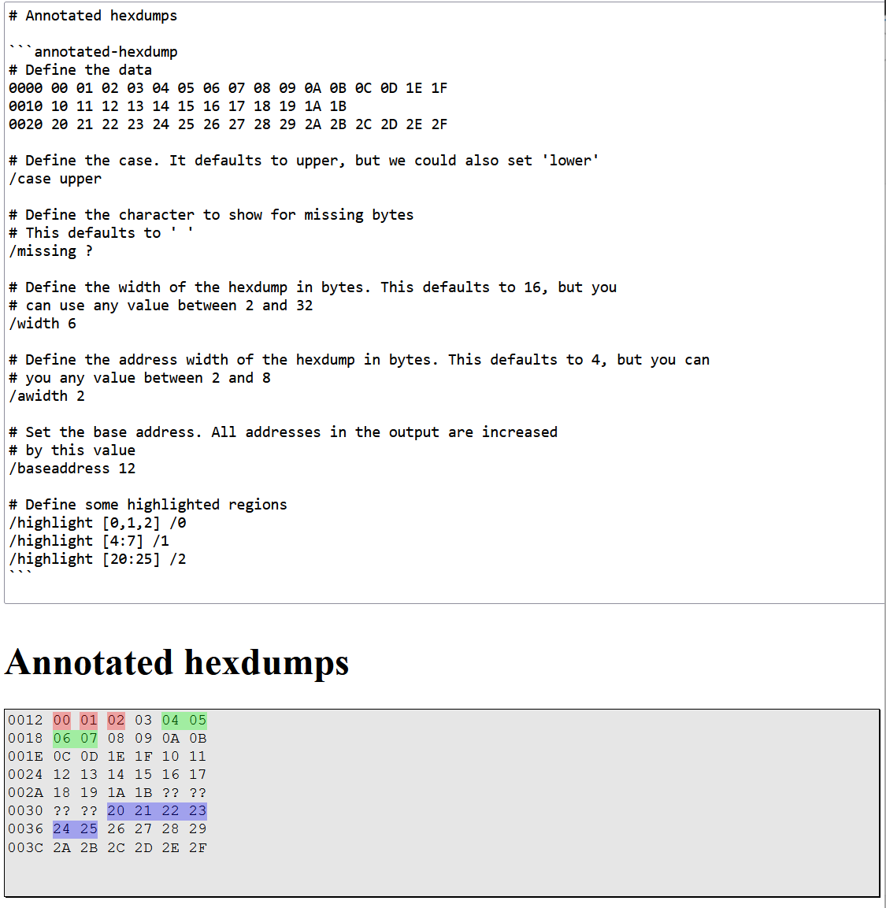
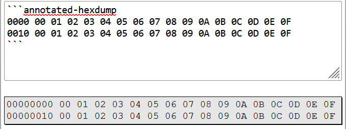
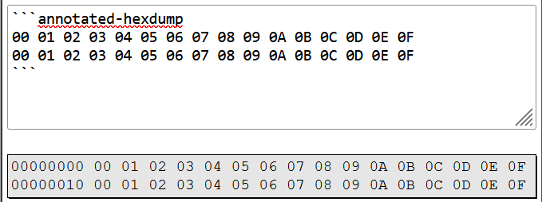
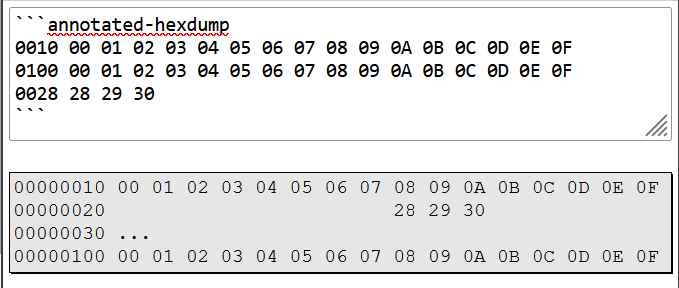
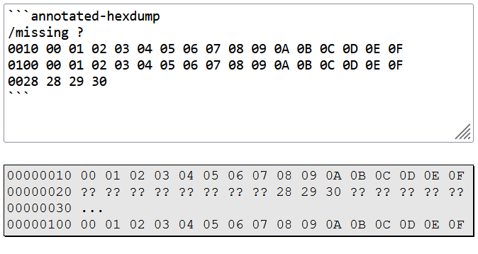
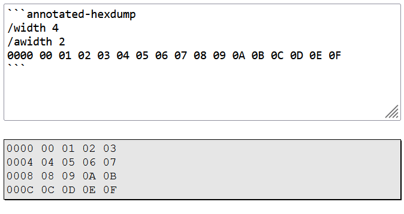
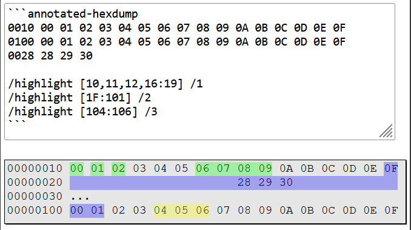

# TODO:

-   [ ] Uncomment release in `/.github/workflows/main.yml`

# marked-annotated-hexdump

Generate annotated hexdumps using markdown. Supports marked and markdown-it



[Give marked support a try in your browser](https://danishcake.github.io/marked-annotated-hexdump/marked)

[Give markdown-it support a try in your browser](https://danishcake.github.io/marked-annotated-hexdump/markdown-it)

## Syntax

Annotated hexdumps are created with an `annotated-hexdump` code-block.

````markdown
```annotated-hexdump
0000 00 01 02 03 04 05 06 07 08 09 0A 0B 0C 0D 0E 0F
0010 00 01 02 03 04 05 06 07 08 09 0A 0B 0C 0D 0E 0F
```
````



You can omit the address, and it'll assume data starts at offset 0.

````markdown
```annotated-hexdump
00 01 02 03 04 05 06 07 08 09 0A 0B 0C 0D 0E 0F
00 01 02 03 04 05 06 07 08 09 0A 0B 0C 0D 0E 0F
```
````



Addresses do not need to be contiguous, or in any particular order.
The only restriction is that you cannot define a range twice. Space will be left for any missing characters.

````markdown
```annotated-hexdump
0010 00 01 02 03 04 05 06 07 08 09 0A 0B 0C 0D 0E 0F
0100 00 01 02 03 04 05 06 07 08 09 0A 0B 0C 0D 0E 0F
0028 28 29 30
```
````



The character used to replace missing bytes can be controlled with `/missing`.

````markdown
```annotated-hexdump
/missing ?

0010 00 01 02 03 04 05 06 07 08 09 0A 0B 0C 0D 0E 0F
0100 00 01 02 03 04 05 06 07 08 09 0A 0B 0C 0D 0E 0F
0028 28 29 30
```
````



The width of the data and address elements in the hexdump can be controlled with `/width` and `/awidth`. `/width` accepts values between 2 and 32. `/awidth` accepts values between 2 and 8. Both are measured in bytes.

````markdown
```annotated-hexdump
/width 4
/awidth 3
0000 00 01 02 03 04 05 06 07 08 09 0A 0B 0C 0D 0E 0F
```
````



You can highlight regions of a hexdump with `/highlight`. This takes two arguments:

-   An inclusive range of addresses to highlight. This is enclosed in square brackets `[]`, and can contain single addresses, or ranges delimited with a colon. Multiple ranges (or single addresses) can be combined with commas.
    -   `[1]` - defines a address 0x01 only
    -   `[1,2,3]` - defines a highlight over 0x01, 0x02 and 0x03. This will be rendered with gaps between the highlights.
    -   `[1:3]` - defines a contiguous highlight over the same three bytes.
    -   `[1:3, 100:200]` - defines two contiguous highlights.
-   A style in the form `/N`, where N is a number between 0 and 15.

````markdown
```annotated-hexdump
0010 00 01 02 03 04 05 06 07 08 09 0A 0B 0C 0D 0E 0F
0100 00 01 02 03 04 05 06 07 08 09 0A 0B 0C 0D 0E 0F
0028 28 29 30

/highlight [10,11,12,16:19] /1
/highlight [1F:101] /2
/highlight [104:106] /3
```
````



You can leave comments by starting a line with `#`. This only works if it's the first character in a line.

## Usage with marked

````js
import { marked } from "marked";
import { annotatedHex } from "marked-annotated-hexdump/marked";

// or UMD script
// <script src="https://cdn.jsdelivr.net/npm/marked/lib/marked.umd.js"></script>
// <script src="https://cdn.jsdelivr.net/npm/marked-annotated-hexdump/lib/index.umd.js"></script>

marked.use(annotatedHex());

marked.parse("```annotated-hexdump\nAA BB CC DD\n```");
````

## Usage with markdown-it

````js
import markdownIt from "../../node_modules/markdown-it/dist/markdown-it";
import { extendMarkdownIt } from "marked-annotated-hexdump/markdown-it";

const md = markdownIt();
extendMarkdownIt(md);

md.render("```annotated-hexdump\nAA BB CC DD\n```");
````

# Limitations

-   If you configure your markdown to wrap, the highlighted regions will be at incorrect positions.<br>
    This might be better expressed using spans rather than an svg overlay
