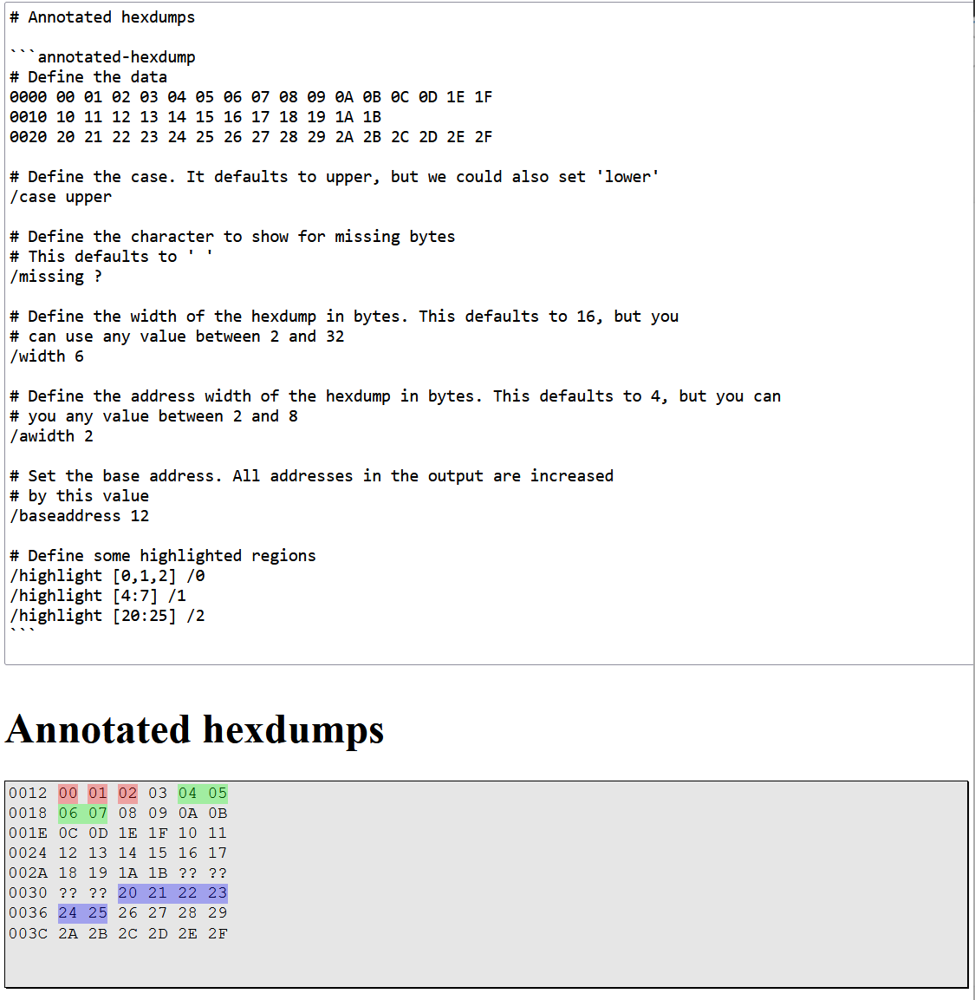

# TODO:

- [ ] Provide usage documentation, including examples and screenshots in `/README.md`
- [ ] Uncomment release in `/.github/workflows/main.yml`


# marked-annotated-hexdump

Generate annotated hexdumps using markdown.



[Give it a try in your browser](https://danishcake.github.io/marked-annotated-hexdump/)

# Usage

```js
import {marked} from "marked";
import {annotatedHex} from "marked-annotated-hexdump";

// or UMD script
// <script src="https://cdn.jsdelivr.net/npm/marked/lib/marked.umd.js"></script>
// <script src="https://cdn.jsdelivr.net/npm/marked-annotated-hexdump|/lib/index.umd.js"></script>

marked.use(annotatedHex());

marked.parse("```annotated-hexdump\nAA BB CC DD\n```");
```
